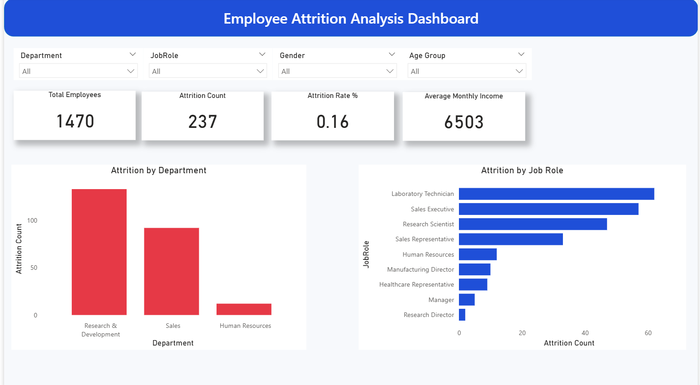
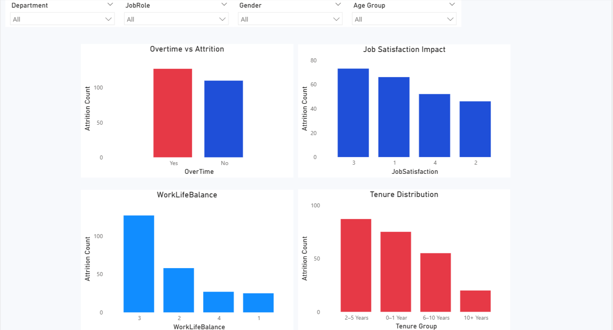

# Employee Attrition Analysis | Power BI & Python

## Dashboard Preview  
### Overview Page

### Demographics Page

### Job & Work Factors Page

---

## Project Summary
This project focuses on analyzing employee attrition to understand the key factors that influence workforce turnover. The analysis aims to identify patterns related to employee demographics, job roles, compensation, tenure, and work conditions.

The project demonstrates an end-to-end data analytics workflow, including data preparation, exploratory analysis, KPI creation, and interactive dashboard development to support data-driven HR decision-making.

---

## Objectives
- Analyze overall employee attrition trends
- Identify high-risk employee segments
- Understand the impact of overtime, tenure, and job satisfaction
- Visualize key HR metrics using an interactive dashboard
- Translate analytical findings into actionable business insights

---

## Tools & Technologies
- Python (Pandas, NumPy)
- Power BI
- CSV dataset
- VS Code
- GitHub for project hosting

---

## Dataset
- IBM HR Analytics Employee Attrition Dataset
- Contains employee-level demographic, job, and compensation data
- Target variable: Attrition (Yes / No)
- Preprocessed to ensure data consistency and usability

---

## Data Preparation Steps
- Verified data types and column consistency
- Checked for missing and duplicate records
- Created derived columns such as:
  - Age Group
  - Tenure Group
- Prepared a cleaned dataset for dashboard visualization

---

## Analysis Performed
- Overall attrition rate calculation
- Department-wise and job role-wise attrition analysis
- Attrition analysis by age group and tenure
- Impact analysis of:
  - Overtime
  - Job satisfaction
  - Work-life balance
- KPI calculation for workforce metrics

---

## Dashboard Overview
The Power BI dashboard includes:

- Total Employees KPI
- Attrition Count KPI
- Attrition Rate (%)
- Average Monthly Income
- Attrition by Department and Job Role
- Demographic analysis (Age Group, Gender, Marital Status)
- Job and work factor analysis (Overtime, Job Satisfaction, Tenure)
- Insights and recommendations page

---

## 🖼 Dashboard Screenshots

### Overview Page

### Demographics Page

### Job & Work Factors Page

---
## Key Insights
- Employees working overtime exhibit significantly higher attrition
- Majority of attrition occurs within the first 2–3 years of employment
- Sales department shows the highest employee turnover
- Lower job satisfaction is strongly associated with higher attrition

---

## Business Impact
- Helps HR teams identify high-risk employee segments
- Supports retention and workforce planning strategies
- Enables data-driven decision-making for employee engagement
- Highlights areas for policy and process improvement

---

## 💡 Business Recommendations
- Reduce excessive overtime through workload balancing
- Strengthen onboarding programs for early-tenure employees
- Introduce retention initiatives for high-attrition departments
- Improve work-life balance policies
- Regular salary benchmarking for critical roles

---

## 📁 Project Structure
Employee-Attrition-Analysis/
│
├── data/
│ └── cleaned_hr_attrition.csv
│
├── notebooks/
│ └── employee_attrition_analysis.ipynb
│
├── dashboard/
│ └── employee_attrition.pbix
│
├── images/
│ ├── overview.png
│ ├── demographics.png
│ └── job_factor.png
│
└── README.md

---

## How to Use
- Review the Python notebook to understand data preparation and analysis
- Open the Power BI file to explore interactive dashboard visuals
- Use insights for HR analytics case studies or portfolio demonstrations

---

## Author
**Hrithik Singh**  
Data Analyst | Excel | SQL | Python | Power BI
